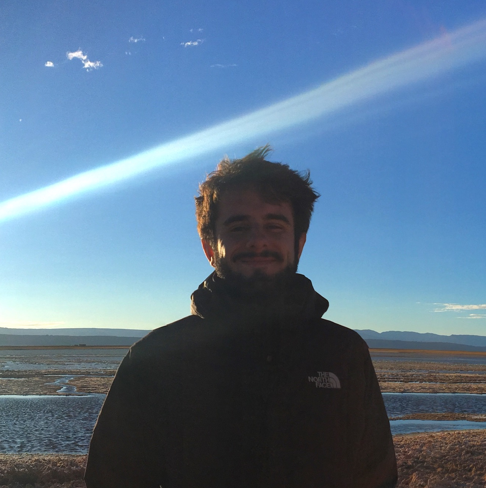

# Gonzalo Garcia-Castro

I am a PhD student at the [**Speech Acquisition and Perception**](http://upf.com/sap) research group at the [**Center for Brain and Cognition**](http://upf.com/cbc) (Universitat Pompeu Fabra, Barcelona, Spain) that dedicates most of his time to research on developmental psycholinguistics. The focus of my research (and of most of my **great** colleages) is the intersection between developmental psychology, language acquisition, bilingualism, and psycholinguistics. In short, I study how babies learn two languages simulatenously, how this relates to other domains of their development. To do this, we design experiments in which babies' behaviour informs us about the processes involved in speech perception and word learning, among others. The techniques we use are mostly based on infant's looking behaviour; we analyse where they look in screen at while they listen to speech.

The end of my BSc in Psychology at University of Oviedo and the beginning of MSc in Neuroscience at Universitat de Barcelona coincided with a time of incertainty in the field of psychological research: a considerable proportion of studies were not *replicable*: their results were unlikely to be found by other researchers; and a highly overlapping proportion of studies were not *reproducible* (it was impossible to know how the authors arrived to their results).

I became especially interested with the concept of **reproducibility**. I realised on how difficult it was to reproduce the results of any study, as it means that one has to track all the steps made in a detailed record, so that whoever wants to reproduce those steps does not get lost in the way. It was even unclear to me how I had arrived to some results I had processed myself! Wherever I looked for solutions, I always ended up arriving to the same suggestion: learn a programming language... 

Years before I had got in touch with what I think is the most recommendable handbook of statistics for both undergrads and graduates I can think of: *Discovering Statistics unsing SPSS*. Maths had always been a source if frustation since childhood. This book made statistics look like something completely different, and even fun. I started reading this book chapter after chapter, just for fun, and made me feel (a bit more) confident about my skill regarding math-related stuff. Since then, I love statistics and spend learning about them much more than my maths teachers could have hoped for. Some months later, I came across a different version of the book: *Discovering Statistics using R*. I had a vague idea of what programming languages, like R, were, but had no experience with them. To be fair, learning to code seemed scary as hell. I gave it a try, and started to learning *R*.

After a very slow start, three attempts, and a lot of frustration, *R* started to make sense. I could apply some commands to do useful stuff, saving me some time, as compared to when I did so with *point-and-click* software (e.g. Microsoft Excel). But the best part was: this script, with its lines of code, would always be there as long as I kept it in my computer. This meant that whenever I wanted to check how I got my results some months later, I could just open the script and see, line by line, the different steps through which my data had passed. Of course I would sometimes forgot what each line of code did: at the time I didn't know how to properly annotate my code. But it was a first step. Some months later, I kept playing with *R* and more occasions to take advantage of it started to come up. I finished my MSc's thesis having prepared a completely reproducible repository with the code, data, and stimuli that resulted from my experiment. Whoever wanted to reproduce my analysise, they would only have to download the folder, read the README file, and start running scripts.

I learned a lot about programming during my MSc. However, most of what I learnt came from something different: the intersection of statistics, wacky zombie films, and lists. As you can have already guessed, the outcome is a database of zombie films. I use this database to learn new things about programming, at the same time I at my disposal a tidy (and reproducible!) database with all zombie movies I was able to find^[I try to update the list every month.]. At some point I decided that such a geeky delight should not be kept in private^[Actually, I had told about it to everyone I had ever crossed two words with.], so `Zombase` is the result of it, and this is its story.

I have many things in mind to do with `Zombase`, but for now I'll focus on releasing some of the coolest analyses and plots^[God, I love plots] I have come up with. I'll try to implement more functionalities as I learn more. Please, enjoy and waste as long as you can watching wacky zombie films that make you learn nothing!

