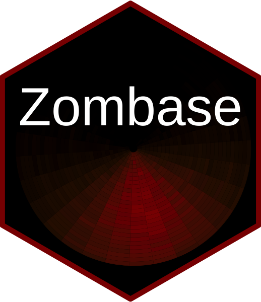

Hi! In this first post I will tell you a bit about this project, and what to expect from it in the short and mid term.

I love zombie-related material as much as I love making lists. Some time ago I started making a list of all zombie films I'd like to watch. The list kept growing and it started to become more of a database. 

Simultaenously, I had to learn some notions of programming and statistics for work reasons (although I ended up enjoying them both a lot). My zombie database (`Zombase`), as I started calling it when talking with my friends seemed like a nice opportunity to put in proactice some of my (very basic) skills and knowlegde on programming and statistics. Making graphics out of the data turned out to be fun! I started adding more information to `Zombase`, and it became more comprehensive and interesting, to me at least. I decided to share the results of this *playground* with others, and created this website to do so.

This website will go throught major changes in the next months, as I'm still getting familiar with the RStudio-GitHub-Netlify workflow this website is built onto, so please be patient! I'll try to periodically upload nice data visualisation, reviews of zombie-material, and some notes on my actual research of my thesis at the [Center for Brain and Cognition](http://www.upf.edu/cbc) at [Universitat Pompeu Fabra](http://www.upf.edu) that mostly falls into the field of developmental psycholinguistics.

Remember that nice, polite, and constructive is always more than welcome!
